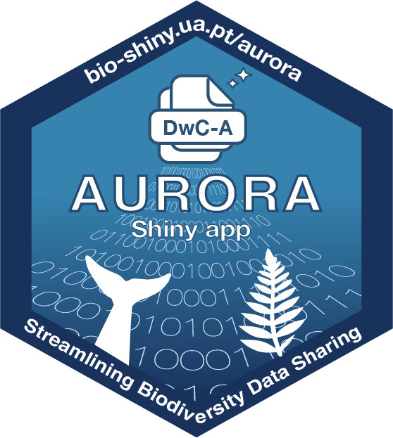

# shinyRv01



Package-style skeleton for a Shiny app + reusable functions.

## Quick start (dev)

```r
install.packages(c("devtools", "roxygen2"))
# In the project root:
# devtools::load_all()
# devtools::document()  # generates NAMESPACE + man/*.Rd
shiny::runApp("inst/app")
```
